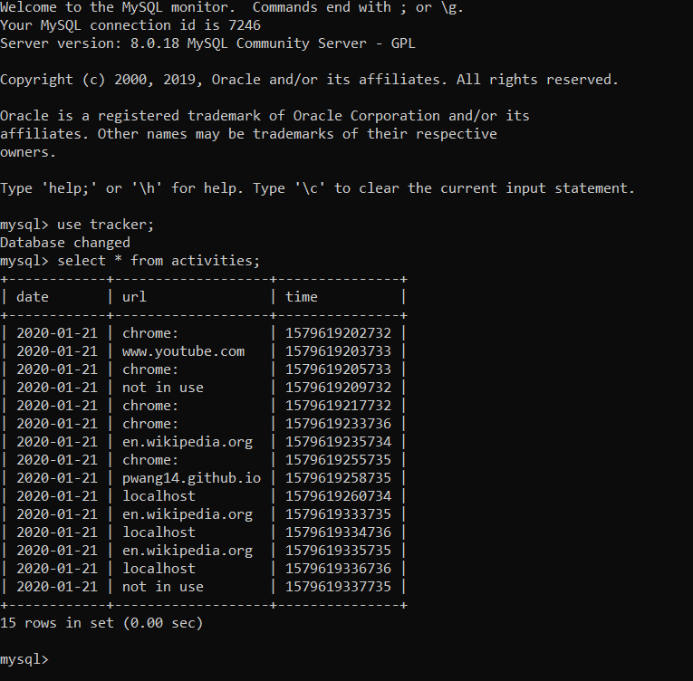
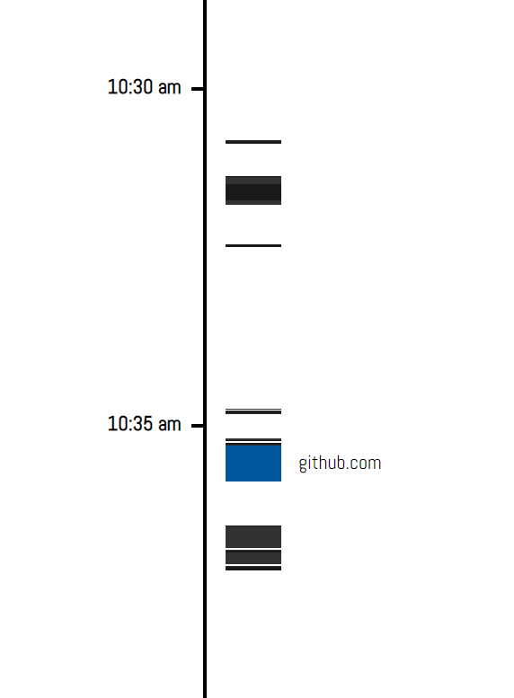

# Tracker access

The two PHP files in this repository (update.php and index.php), interact with a local MySQL server storing the user's web activity on Google Chrome.
The files connect to the MySQL server using the MySQLi extension.

### update.php

When update.php is called, it accesses the 'tracker' database in the local server. For each call, it is provided with a date, a URL, and a time of call.
It executes a MySQL command to insert these values as a single entry into the 'activities' table located in 'tracker'.

### index.php

When index.php is called, it accesses the 'tracker' database in the local server. It first deletes all entries in 'activities' from more than a week ago.
It then deletes the entries in the 'todayact' table and inserts the entries from 'acitivites' that happened today into 'todayact'.
Finally, it reads the new entries in 'todayact', and stores the values of their parameters into arrays.
It passes these arrays to a JavaScript script, which takes the data and creates a visual timeline to display the entries in 'todayact'

With these PHP files, the Chrome extension run by the user can automatically store its data in a local MySQL server, and the user can later access this data by accessing the index.php file in the localhost server.
My test website also contains a link to index.php, so the user can see the tracker data at my test website.